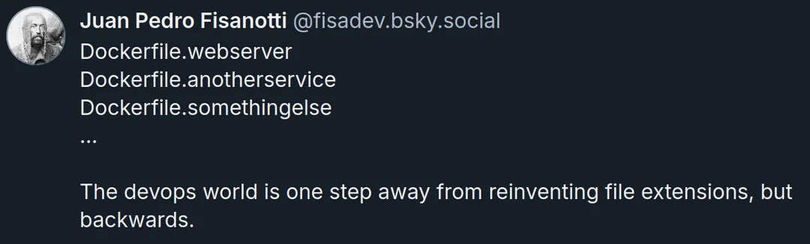

# Aquia Base Docker Images

This repository contains Dockerfiles and releases of hardened Aquia Base Docker Images.

[](https://github.com/aquia-inc/base-docker-images/releases/latest) [](https://github.com/aquia-inc/base-docker-images/releases/latest)



## WiP

This repository is a work in progress, but the produced images are considered stable, unless otherwise noted below.

These images are **rebuilt daily**.

**Ensure you are using the `--pull` flag in yoiur build scripts/CI/CD to pick up the latests CVE fixes.**

## Available Images

[](https://github.com/aquia-inc/base-docker-images/pkgs/container/base-docker-images%2Ffips-140-3-linux-amd64) 

[](https://github.com/aquia-inc/base-docker-images/pkgs/container/base-docker-images%2Fgo-base-linux-amd64) 

[](https://github.com/aquia-inc/base-docker-images/pkgs/container/base-docker-images%2Fgo-base-1.27-linux-amd64) 

[](https://github.com/aquia-inc/base-docker-images/pkgs/container/base-docker-images%2Fnginx-base-linux-amd64) 

[](https://github.com/aquia-inc/base-docker-images/pkgs/container/base-docker-images%2Fnodejs-base-linux-amd64) 

[](https://github.com/aquia-inc/base-docker-images/pkgs/container/base-docker-images%2Fopenjdk17-base-linux-amd64) 

[](https://github.com/aquia-inc/base-docker-images/pkgs/container/base-docker-images%2Fpython-base-linux-amd64) 

[](https://github.com/aquia-inc/base-docker-images/pkgs/container/base-docker-images%2Fwolfi-base-linux-amd64) 
 
### Latest linux/amd64 Releases

* [fips-140-3-linux-amd64](https://github.com/aquia-inc/base-docker-images/pkgs/container/base-docker-images%2Ffips-140-3-linux-amd64)
* [go-base-linux-amd64](https://github.com/aquia-inc/base-docker-images/pkgs/container/base-docker-images%2Fgo-base-linux-amd64)
* [go-base-1.27-linux-amd64](https://github.com/aquia-inc/base-docker-images/pkgs/container/base-docker-images%2Fgo-base-1.27-linux-amd64)
* [nginx-base-linux-amd64](https://github.com/aquia-inc/base-docker-images/pkgs/container/base-docker-images%2Fnginx-base-linux-amd64)
* [nodejs-base-linux-amd64](https://github.com/aquia-inc/base-docker-images/pkgs/container/base-docker-images%2Fnodejs-base-linux-amd64)
* [openjdk17-base-linux-amd64](https://github.com/aquia-inc/base-docker-images/pkgs/container/base-docker-images%2Fopenjdk17-base-linux-amd64)
* [python-base-linux-amd64](https://github.com/aquia-inc/base-docker-images/pkgs/container/base-docker-images%2Fpython-base-linux-amd64)
* [wolfi-base-linux-amd64](https://github.com/aquia-inc/base-docker-images/pkgs/container/base-docker-images%2Fwolfi-base-linux-amd64)

### Latest linux/arm64 Releases

* [fips-140-3-linux-arm64](https://github.com/aquia-inc/base-docker-images/pkgs/container/base-docker-images%2Ffips-140-3-linux-arm64)
* [go-base-linux-arm64](https://github.com/aquia-inc/base-docker-images/pkgs/container/base-docker-images%2Fgo-base-linux-arm64)
* [go-base-1.27-linux-arm64](https://github.com/aquia-inc/base-docker-images/pkgs/container/base-docker-images%2Fgo-base-1.27-linux-arm64)
* [nginx-base-linux-arm64](https://github.com/aquia-inc/base-docker-images/pkgs/container/base-docker-images%2Fnginx-base-linux-arm64)
* [nodejs-base-linux-arm64](https://github.com/aquia-inc/base-docker-images/pkgs/container/base-docker-images%2Fnodejs-base-linux-arm64)
* [openjdk17-base-linux-arm64](https://github.com/aquia-inc/base-docker-images/pkgs/container/base-docker-images%2Fopenjdk17-base-linux-arm64)
* [python-base-linux-arm64](https://github.com/aquia-inc/base-docker-images/pkgs/container/base-docker-images%2Fpython-base-linux-arm64)
* [wolfi-base-linux-arm64](https://github.com/aquia-inc/base-docker-images/pkgs/container/base-docker-images%2Fwolfi-base-linux-arm64)

## Hardening

Images are considered hardened when they do not contain fixable-today CVE vulnerabilities of the following severities: CRITICAL, HIGH, MEDIUM. They are based on [wolfi-base](<https://edu.chainguard.dev/open-source/wolfi/overview/>) from Chainguard. We use Renovate to automatically update each of these base images to the most recently published image ([`latest`](https://edu.chainguard.dev/chainguard/chainguard-images/reference/wolfi-base/tags_history/)).

### Accepted risks (time-boxed)

The Trivy gate runs at a MEDIUM severity floor with `ignore-unfixed`, so a finding normally blocks a build only when a fixed package actually exists. Occasionally an advisory names a fixed version that the distribution has not packaged yet: the finding counts as "fixed" and blocks the build, but no rebuild can clear it because the fixed package cannot be installed.

Those cases are recorded in [`.trivyignore.yaml`](./.trivyignore.yaml). Every entry carries a mandatory `expired_at` date which Trivy enforces - once the date passes the finding fails builds again, so an ignore cannot quietly become permanent.

An entry is an accepted risk, never a fix, and it is only justified while no fixed package is installable. As soon as the distribution ships a fix the entry is removed, because an ignore left in place would then mask a finding that is genuinely fixable.

**There are currently no accepted risks.** `.trivyignore.yaml` is empty and every image is expected to pass the gate on its own merit.

## Current Language Versions

* **Go**: 1.26.x (go-base, from wolfi-base with the go-1.26 package)
* **Go**: 1.27.x (go-base-1.27, from wolfi-base with the go-1.27 package)
* **Node.js**: 24.18.x with npm 12.0.x (from wolfi-base with nodejs/npm packages)
* **Python**: 3.13.x (from wolfi-base with the python-3.13 package)
* **OpenJDK**: 17.x with Maven 3.9.8 (from wolfi-base with openjdk-17 package)
* **Wolfi Base**: Latest minimal Linux distribution
* **FIPS 140-3 Base** (`fips-140-3`): CMVP-validated OpenSSL FIPS Provider 3.1.2 (FIPS 140-3, cert #4985, sunset 2030-03-10), module-only on wolfi-base. User-affirmed per CMVP Management Manual 7.9.2 - NOT "FIPS validated on Wolfi". See [FIPS.md](./FIPS.md). ([beta](#beta-images))
* **Nginx**: 1.29.x with headers-more module (custom build)

`fips-base` is no longer listed above: it was retired on 2026-09-21 when its FIPS 140-2 certificates reached their NIST sunset date, and is no longer built. Its tags were republished onto `fips-140-3`, so existing `FROM ...fips-base...` references keep working unchanged. The reasoning, the per-tag mapping and the two compatibility caveats are in [FIPS-enabled base images](#fips-enabled-base-images) and [FIPS.md](./FIPS.md).

### Recommended Version Pinning

The images are tagged with [Semantic Versioning](https://semver.org/) and also with the installed language's major (i.e. `python-base:3`, `nodejs-base:24`) and major + minor (i.e. `python-base:3.13`, `go-base:1.26`, `nodejs-base:24.18`) versions (currently implemented for Python, Node.js, OpenJDK, and Go).

If you want to ensure that your image's installed language is not updated to a potentially non-backwards-compatible version, you can pin the version of the image you are using to the specific version of the language you want - i.e. `python-base:3.13` or `nodejs-base:24.18`.

Note, however, that due to the limitations of our using Chainguard's free tier, we can only keep the latest wolfi-base image up-to-date, so once wolfi-base moves to python 3.14 or nodejs 25 for example, the python-base:3.13 or nodejs-base:24.18 will no longer be automatically patched by our workflows.

On the other hand, pinning your image to `python-base:3` or `nodejs-base:24` for example, allows you to receive all security updates within that major version, but it will also force you to upgrade to the next minor version whenever wolfi-base is updated to that version of the language.

Both choices have tradeoffs and is a decision you need to make based on your project's needs.

The non-language-specific images, such as the `nginx-base` and `wolfi-base` images can be pinned to `:latest`, as they are unlikely to bring backwards-incompatible changes to your workloads.

## How to Use

### Ensure your base image is always fresh

By default, docker build will use a cached version of a base image if it already exists in the build environment. Because your Dockerfile uses mutable tags like :latest, there's a risk that your CI/CD pipeline could use a stale base image, potentially missing critical security patches.

To prevent this, you should add the `--pull` flag to your `docker build` command. This flag explicitly tells Docker to always attempt to pull a newer version of the base image from the remote registry before starting the build.

**In your CI/CD pipelines, always use:**

```shell
docker build --pull -t your-app .
```

**In your Dockerfile:**

```dockerfile
FROM ghcr.io/aquia-inc/base-docker-images/<image-name>:latest
```

### Authenticating to GHCR

While these images are public and can be pulled without authentication, anonymous pulls are subject to stricter rate limits. For use in CI/CD pipelines or for frequent local development, it is highly recommended to authenticate with a Personal Access Token (PAT) to avoid potential rate-limiting issues.

```shell
export CR_PAT=YOUR_TOKEN
$ echo $CR_PAT | docker login ghcr.io -u USERNAME --password-stdin
> Login Succeeded
```

### Use Base Image in Your Project

All currently available images are [listed here](https://github.com/orgs/aquia-inc/packages?repo_name=base-docker-images).

To use an image in your project, you can use the following snippet:

```shell
FROM ghcr.io/aquia-inc/base-docker-images/<docker-image-name>:<tag>
```

Anyone can pull the image locally with their Github [personal access token](https://docs.github.com/en/packages/working-with-a-github-packages-registry/working-with-the-container-registry#authenticating-to-the-container-registry).

### Beta images

The beta images are tested within limited scope and are generally stable but not recommended for production use without thorough testing in lower environments.  We encourage you to use them for testing and development and provide feedback to us to help us get them to GA faster.  If any bugs or unexpected behaviors are encountered, please open an issue using the BUG_REPORT template in this repository with enough detail to reproduce the issue.

#### FIPS-enabled base images

**`fips-140-3`** is the FIPS base image: OpenSSL FIPS Provider 3.1.2, NIST CMVP certificate #4985 (sunset 2030-03-10). New work should reference it by name.

**`fips-base` was retired on 2026-09-21** and is no longer built. Its FIPS 140-2 certificates (#4282 / #4811, OpenSSL 3.0.9) reached their NIST sunset date and moved to the Historical list; after that date an image branded "FIPS 140-2" is not defensible in a compliance audit.

**Nothing broke for consumers.** Rather than retiring the name, the `fips-base` tags were republished onto the FIPS 140-3 image, so an existing `FROM ...fips-base...` keeps resolving and transparently moved to 140-3 - no Dockerfile change was required. The tracking tags (`:latest`, `:fips3`, `:fips3.1`) follow the 140-3 image on every rebuild; the frozen `:openssl3` / `:openssl3.0` tags and the `:2.0.0` cutover marker are handled separately. The full per-tag mapping is in [FIPS.md](./FIPS.md#how-the-tags-are-republished).

**What to check:** for most workloads, nothing. Two things matter, because the 140-3 image is built on Wolfi/glibc where the 140-2 `fips-base` was Alpine/musl:

- **Native binaries:** anything compiled on top of `fips-base` (Go cgo, C extensions) must be rebuilt on the new base - musl binaries do not run on glibc. Interpreted runtimes and OpenSSL-CLI usage are unaffected.
- **User/UID:** the default user changes from `nobody` (65534) to `nonroot` (65532); update any hardcoded UID, file ownership, or Kubernetes `runAsUser`.

The old `/usr/local/ssl` OpenSSL config paths are preserved on the 140-3 image, so FIPS stayed enforced through the cutover rather than silently turning off.

**Pinning after the cutover:** the cutover shipped as a new major version (`fips-base:2.0.0`) and swapped the descriptive tag from `openssl3.0` (FIPS 140-2) to `fips3.1` (FIPS 140-3):

- `fips-base:latest` or `fips-base:fips3.1` resolve to the FIPS 140-3 image. Referencing `fips-140-3` directly is clearer for new work.
- `fips-base:openssl3.0` (and the pre-cutover `v1.x` tags) are frozen at the last FIPS 140-2 build and no longer receive patches, so treat them as a signal to move rather than a place to stay.

Full compliance detail is in [FIPS.md](./FIPS.md).

### Nginx Security

#### Overview

If you are using the nginx image provided in this repository, you should also use the `nginx.conf` file in this repository if you need to make any changes to it.  In most cases, you should not need to make any changes to the nginx configuration as it is already matching configuration set up in the container.

Starting nginx as user `root`

The nginx server in the nginx image should be run as user `nginx` for security reasons, but the server can also be started as user `root` in situations where nginx needs to bind to ports <= 1024, i.e. `0.0.0.0:80`.  In those scenarios nginx parent process will be started as `root`, then drop privileges when starting worker processes by switching to user `nginx`.
This mode of operation requires that the following stanza at the top of the [`nginx.conf`](./nginx.conf) config file is uncommented and looks as follows:

```shell
    user nginx;
```

#### Your nginx Container

Running nginx unprivileged, on ports > 1024:

      PID   USER     TIME  COMMAND
      1 nginx     0:00 nginx: master process /usr/sbin/nginx -c /etc/nginx/nginx.conf -e /dev/stderr -g daemon off;
      7 nginx     0:00 nginx: worker process
      8 nginx     0:00 nginx: worker process
      9 nginx     0:00 nginx: worker process
     10 nginx     0:00 nginx: worker process
     11 nginx     0:00 /bin/sh
    232 nginx     0:00 ps aux

Running on lower ports as user `root` and worker processes running as user `nginx` after starting the container, will look similar to the below:

    PID   USER     TIME  COMMAND
      1 root      0:00 nginx: master process /usr/sbin/nginx -c /etc/nginx/nginx.conf -e /dev/stderr -g daemon off;
      8 nginx     0:00 nginx: worker process
      9 nginx     0:00 nginx: worker process
     10 nginx     0:00 nginx: worker process
     11 nginx     0:00 nginx: worker process
     12 root      0:00 /bin/sh
     18 root      0:00 ps aux

Please see the <a href="examples/">examples</a> directory for an example nginx workload <A href="examples/default.conf">configuration</a> file and the corresponding <a href="examples/Dockerfile.example.nginx">Dockerfile</a>.

### Go Application Development

For Go applications, see the <a href="examples/">examples</a> directory for a simple Go hello world example and the corresponding <a href="examples/Dockerfile.example.go">Dockerfile</a> that demonstrates how to build secure, multi-stage Go applications using our hardened base images.

## Contributing

### Add New Image

PR to `main` with new Dockerfile in format `Dockerfile.<image-name>`. This will build your Docker image with semver tag `0.0.1`.

### Update Image

1. Merge PR to main.
2. Workflow will diff which Dockerfiles changed and create release tags for them.
3. Workflow triggered by creation of new release tag will build new Docker image, incrementing the patch version and setting it to `latest`.

### Run the Structure Tests Locally

Each image has a [container-structure-test](https://github.com/GoogleContainerTools/container-structure-test)
suite in `tests/container-structure/<image-name>.yaml`. CI pins the tool to
v1.22.1.

Always pass `--platform` matching the image. The tool creates its test
container for the host platform unless told otherwise, so testing an arm64
image on an amd64 machine (or the reverse) fails every command test with
"its platform ... does not match the specified platform":

```shell
container-structure-test test \
  --platform linux/arm64 \
  --image ghcr.io/aquia-inc/base-docker-images/python-base-linux-arm64:latest \
  --config tests/container-structure/python-base.yaml
```

### Rebuild an Image Manually

You must have permissions to push tags to this repository.

1. Make sure you are on the commit that you want to create the tag from.
2. Create tag in the format:

   ```shell
   git tag -a release/<docker-image-name>/vX.X.X -m "release description"
   ```

3. Push tag:

   ```shell
   git push origin <tag-name>
   ```

For example:

  ```shell
  git checkout main
  git pull
  git tag -a release/python-base/v0.0.2 -m "Rebuild to pickup fix for CVE-2023-43804 urllib3 MEDIUM"
  git push origin release/python-base/v0.0.2
  ```

## Credits

Our container base images are built from the base images provided by the excellent people at <a href="https://www.chainguard.dev/">Chainguard</a> and are the result of their dedication to the open-source spirit and a relentless focus on security. It's their commitment to exxcellence that allows us to provide reliable and efficient foundations for your projects.  We extend our deepest gratitude to the team at Chainguard for their pioneering work that has been an inspiration for this repository -  it has directly enabled us to build the secure images you are using today.  If you value a robust and secure software supply chain and appreciate the work that goes into building and maintaining these critical foundational images, we strongly encourage you to consider <a href="https://www.chainguard.dev/">Chainguard</a> for your business.
