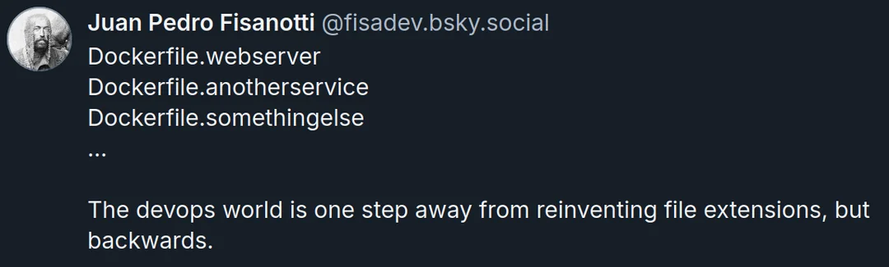

# Aquia Base Docker Images

This repository contains Dockerfiles and releases of hardened Aquia Base Docker Images.

[](https://github.com/aquia-inc/base-docker-images/releases/latest) [](https://github.com/aquia-inc/base-docker-images/releases/latest)



## WiP

This repository is a work in progress, but the produced images are considered stable, unless otherwise noted below.

## Available Images

[](https://github.com/aquia-inc/base-docker-images/pkgs/container/base-docker-images%2Ffips-base-linux-amd64) 

[](https://github.com/aquia-inc/base-docker-images/pkgs/container/base-docker-images%2Fgo-base-linux-amd64) 

[](https://github.com/aquia-inc/base-docker-images/pkgs/container/base-docker-images%2Fnginx-base-linux-amd64) 

[](https://github.com/aquia-inc/base-docker-images/pkgs/container/base-docker-images%2Fnodejs-base-linux-amd64) 

[](https://github.com/aquia-inc/base-docker-images/pkgs/container/base-docker-images%2Fopenjdk17-base-linux-amd64) 

[](https://github.com/aquia-inc/base-docker-images/pkgs/container/base-docker-images%2Fpython-base-linux-amd64) 

[](https://github.com/aquia-inc/base-docker-images/pkgs/container/base-docker-images%2Fwolfi-base-linux-amd64) 
 
### Latest linux/amd64 Releases

* [fips-base-linux-amd64](https://github.com/aquia-inc/base-docker-images/pkgs/container/base-docker-images%2Ffips-base-linux-amd64)
* [go-base-linux-amd64](https://github.com/aquia-inc/base-docker-images/pkgs/container/base-docker-images%2Fgo-base-linux-amd64)
* [nginx-base-linux-amd64](https://github.com/aquia-inc/base-docker-images/pkgs/container/base-docker-images%2Fnginx-base-linux-amd64)
* [nodejs-base-linux-amd64](https://github.com/aquia-inc/base-docker-images/pkgs/container/base-docker-images%2Fnodejs-base-linux-amd64)
* [openjdk17-base-linux-amd64](https://github.com/aquia-inc/base-docker-images/pkgs/container/base-docker-images%2Fopenjdk17-base-linux-amd64)
* [python-base-linux-amd64](https://github.com/aquia-inc/base-docker-images/pkgs/container/base-docker-images%2Fpython-base-linux-amd64)
* [wolfi-base-linux-amd64](https://github.com/aquia-inc/base-docker-images/pkgs/container/base-docker-images%2Fwolfi-base-linux-amd64)

### Latest linux/arm64 Releases

* [fips-base-linux-arm64](https://github.com/aquia-inc/base-docker-images/pkgs/container/base-docker-images%2Ffips-base-linux-arm64)
* [go-base-linux-arm64](https://github.com/aquia-inc/base-docker-images/pkgs/container/base-docker-images%2Fgo-base-linux-arm64)
* [nginx-base-linux-arm64](https://github.com/aquia-inc/base-docker-images/pkgs/container/base-docker-images%2Fnginx-base-linux-arm64)
* [nodejs-base-linux-arm64](https://github.com/aquia-inc/base-docker-images/pkgs/container/base-docker-images%2Fnodejs-base-linux-arm64)
* [openjdk17-base-linux-arm64](https://github.com/aquia-inc/base-docker-images/pkgs/container/base-docker-images%2Fopenjdk17-base-linux-arm64)
* [python-base-linux-arm64](https://github.com/aquia-inc/base-docker-images/pkgs/container/base-docker-images%2Fpython-base-linux-arm64)
* [wolfi-base-linux-arm64](https://github.com/aquia-inc/base-docker-images/pkgs/container/base-docker-images%2Fwolfi-base-linux-arm64)

## Hardening

Images are considered hardened when they do not contain fixed CVE vulnerabilities of the following severities: CRITICAL, HIGH, MEDIUM. They are based on [wolfi-base](<https://edu.chainguard.dev/open-source/wolfi/overview/>) from Chainguard. We use Renovate to automatically update each of these base images to the most recently published image ([`latest`](https://edu.chainguard.dev/chainguard/chainguard-images/reference/wolfi-base/tags_history/)).

## Current Language Versions

* **Go**: 1.25.x (from chainguard/go:latest)
* **Node.js**: 24.6.x with npm 11.5.x (from wolfi-base with nodejs/npm packages)
* **Python**: 3.13.x (from wolfi-base with python3 package)
* **OpenJDK**: 17.x with Maven 3.9.8 (from wolfi-base with openjdk-17 package)
* **Wolfi Base**: Latest minimal Linux distribution
* **FIPS Base**: Custom OpenSSL 3.0.9 with FIPS validation ([beta](#beta-images))
* **Nginx**: 1.29.x with headers-more module (custom build)

### Recommended Version Pinning

The images are tagged with [Semantic Versioning](https://semver.org/) and also with the installed language's major (i.e. `python-base:3`, `nodejs-base:24`) and major + minor (i.e. `python-base:3.13`, `go-base:1.25`, `nodejs-base:24.6`) versions (currently implemented for Python, Node.js, OpenJDK, and Go).

If you want to ensure that your image's installed language is not updated to a potentially non-backwards-compatible version, you can pin the version of the image you are using to the specific version of the language you want - i.e. `python-base:3.13` or `nodejs-base:24.6`.

Note, however, that due to the limitations of our using Chainguard's free tier, we can only keep the latest wolfi-base image up-to-date, so once wolfi-base moves to python 3.14 or nodejs 25 for example, the python-base:3.13 or nodejs-base:24.6 will no longer be automatically patched by our workflows.

On the other hand, pinning your image to `python-base:3` or `nodejs-base:24` for example, allows you to receive all security updates within that major version, but it will also force you to upgrade to the next minor version whenever wolfi-base is updated to that version of the language.

Both choices have tradeoffs and is a decision you need to make based on your project's needs.

The non-language-specific images, such as the `nginx-base`, `fips-base`, and `wolfi-base` images can be pinned to `:latest`, as they are unlikely to bring backwards-incompatible changes to your workloads.

## How to Use

### Ensure your base image is always fresh

By default, docker build will use a cached version of a base image if it already exists in the build environment. Because your Dockerfile uses mutable tags like :latest, there's a risk that your CI/CD pipeline could use a stale base image, potentially missing critical security patches.

To prevent this, you should add the `--pull` flag to your `docker build` command. This flag explicitly tells Docker to always attempt to pull a newer version of the base image from the remote registry before starting the build.

**In your CI/CD pipelines, always use:**

```shell
docker build --pull -t your-app .
```

**In your Dockerfile:**

```dockerfile
FROM ghcr.io/aquia-inc/base-docker-images/<image-name>:latest
```

### Authenticating to GHCR

While these images are public and can be pulled without authentication, anonymous pulls are subject to stricter rate limits. For use in CI/CD pipelines or for frequent local development, it is highly recommended to authenticate with a Personal Access Token (PAT) to avoid potential rate-limiting issues.

```shell
export CR_PAT=YOUR_TOKEN
$ echo $CR_PAT | docker login ghcr.io -u USERNAME --password-stdin
> Login Succeeded
```

### Use Base Image in Your Project

All currently available images are [listed here](https://github.com/orgs/aquia-inc/packages?repo_name=base-docker-images).

To use an image in your project, you can use the following snippet:

```shell
FROM ghcr.io/aquia-inc/base-docker-images/<docker-image-name>:<tag>
```

Anyone can pull the image locally with their Github [personal access token](https://docs.github.com/en/packages/working-with-a-github-packages-registry/working-with-the-container-registry#authenticating-to-the-container-registry).

### Beta images

The beta images are tested within limited scope and are generally stable but not recommended for production use without thorough testing in lower environments.  We encourage you to use them for testing and development and provide feedback to us to help us get them to GA faster.  If any bugs or unexpected behaviors are encountered, please open an issue using the BUG_REPORT template in this repository with enough detail to reproduce the issue.

#### FIPS-enabled base image

The image built from the [Dockerfile.fips-base](./Dockerfile.fips-base) includes FIPS-enabled OpenSSL and the Dockerfile shows an example of how to use it in the `Example Stage 2` section that should be modified to your workload's specific needs.

[More information on the FIPS image.](./FIPS.md)

### Nginx Security

#### Overview

If you are using the nginx image provided in this repository, you should also use the `nginx.conf` file in this repository if you need to make any changes to it.  In most cases, you should not need to make any changes to the nginx configuration as it is already matching configuration set up in the container.

Starting nginx as user `root`

The nginx server in the nginx image should be run as user `nginx` for security reasons, but the server can also be started as user `root` in situations where nginx needs to bind to ports <= 1024, i.e. `0.0.0.0:80`.  In those scenarios nginx parent process will be started as `root`, then drop privileges when starting worker processes by switching to user `nginx`.
This mode of operation requires that the following stanza at the top of the [`nginx.conf`](./nginx.conf) config file is uncommented and looks as follows:

```shell
    user nginx;
```

#### Your nginx Container

Running nginx unprivileged, on ports > 1024:

      PID   USER     TIME  COMMAND
      1 nginx     0:00 nginx: master process /usr/sbin/nginx -c /etc/nginx/nginx.conf -e /dev/stderr -g daemon off;
      7 nginx     0:00 nginx: worker process
      8 nginx     0:00 nginx: worker process
      9 nginx     0:00 nginx: worker process
     10 nginx     0:00 nginx: worker process
     11 nginx     0:00 /bin/sh
    232 nginx     0:00 ps aux

Running on lower ports as user `root` and worker processes running as user `nginx` after starting the container, will look similar to the below:

    PID   USER     TIME  COMMAND
      1 root      0:00 nginx: master process /usr/sbin/nginx -c /etc/nginx/nginx.conf -e /dev/stderr -g daemon off;
      8 nginx     0:00 nginx: worker process
      9 nginx     0:00 nginx: worker process
     10 nginx     0:00 nginx: worker process
     11 nginx     0:00 nginx: worker process
     12 root      0:00 /bin/sh
     18 root      0:00 ps aux

Please see the <a href="examples/">examples</a> directory for an example nginx workload <A href="examples/default.conf">configuration</a> file and the corresponding <a href="examples/Dockerfile.example.nginx">Dockerfile</a>.

### Go Application Development

For Go applications, see the <a href="examples/">examples</a> directory for a simple Go hello world example and the corresponding <a href="examples/Dockerfile.example.go">Dockerfile</a> that demonstrates how to build secure, multi-stage Go applications using our hardened base images.

## Contributing

### Add New Image

PR to `main` with new Dockerfile in format `Dockerfile.<image-name>`. This will build your Docker image with semver tag `0.0.1`.

### Update Image

1. Merge PR to main.
2. Workflow will diff which Dockerfiles changed and create release tags for them.
3. Workflow triggered by creation of new release tag will build new Docker image, incrementing the patch version and setting it to `latest`.

### Rebuild an Image Manually

You must have permissions to push tags to this repository.

1. Make sure you are on the commit that you want to create the tag from.
2. Create tag in the format:

   ```shell
   git tag -a release/<docker-image-name>/vX.X.X -m "release description"
   ```

3. Push tag:

   ```shell
   git push origin <tag-name>
   ```

For example:

  ```shell
  git checkout main
  git pull
  git tag -a release/python-base/v0.0.2 -m "Rebuild to pickup fix for CVE-2023-43804 urllib3 MEDIUM"
  git push origin release/python-base/v0.0.2
  ```

## Credits

Our container base images are built from the base images provided by the excellent people at <a href="https://www.chainguard.dev/">Chainguard</a> and are the result of their dedication to the open-source spirit and a relentless focus on security. It's their commitment to exxcellence that allows us to provide reliable and efficient foundations for your projects.  We extend our deepest gratitude to the team at Chainguard for their pioneering work that has been an inspiration for this repository -  it has directly enabled us to build the secure images you are using today.  If you value a robust and secure software supply chain and appreciate the work that goes into building and maintaining these critical foundational images, we strongly encourage you to consider <a href="https://www.chainguard.dev/">Chainguard</a> for your business.
